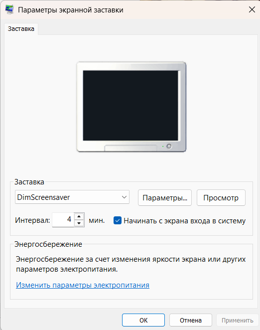

# Dim Screensaver

Windows screen saver experiments that show the current Windows desktop wallpaper, then dim that image over a configurable delay.
Both implementations redraw the dimmed frame at about 15 frames per second.

Implementations:

- [`dim-screensaver-C`](dim-screensaver-C): native Win32 C version using the configured wallpaper image and a black dim layer.
- [`dim-screensaver-C-sharp`](dim-screensaver-C-sharp): C# / Windows Forms version using the configured wallpaper image and black dim layers.

## Build

```powershell
cd .\dim-screensaver-C-sharp
.\build.ps1
```

Or build the native C version:

```powershell
cd .\dim-screensaver-C
.\build.ps1
```

The C build is produced at:

```text
dim-screensaver-C\publish\DimScreensaver.scr
dim-screensaver-C\publish\DimScreensaver.ini
```

The C# build is produced at:

```text
dim-screensaver-C-sharp\publish\DimScreensaver.scr
dim-screensaver-C-sharp\publish\DimScreensaver.ini
```

## Settings

Keep the `.ini` file next to the `.scr` file. The file name should match the screen saver file name with the extension changed to `.ini`, for example `DimScreensaver.ini` next to `DimScreensaver.scr`.

```ini
FadeInSeconds=10
FadeOutSeconds=1
LockWorkstation=true
```

Set `FadeInSeconds` to `10`, `20`, or `60` to give the user 10 seconds, 20 seconds, or 1 minute to react before Windows is locked. Set `FadeOutSeconds` to control how quickly the saver disappears after mouse or keyboard input. Set `LockWorkstation=false` to keep the screen dimmed without locking Windows. If the file is missing or a value cannot be read, the defaults are 10 seconds fade-in, 1 second fade-out, and `LockWorkstation=true`.

The older `LockDelaySeconds` key is still accepted as an alias for `FadeInSeconds`.

## Diagnostics

On startup, Dim Screensaver writes `DimScreensaver.log` next to the `.scr` file. If Windows does not allow writing there, it falls back to:

```text
%LOCALAPPDATA%\DimScreensaver\DimScreensaver.log
```

The log records the command line, selected mode, settings file path, desktop name, virtual screen bounds, wallpaper loading result, and any emergency desktop-capture fallback result.

## Try It

```powershell
.\dim-screensaver-C\publish\DimScreensaver.scr /s
```

Move the mouse, click, or press any key to fade it out over 1 second and close it.
The mouse cursor is hidden before the fade starts and restored on exit.
If there is no input during the configured dimming period, the saver calls Windows Lock Workstation after the fade completes.

## Windows Setup

Configure Dim Screensaver as a normal Windows screen saver, and set its wait time earlier than the display power-off timeout. For example, start the screen saver after 4 minutes, then configure Windows power settings to turn the display off later.

Leave the Windows **On resume, display logon screen** checkbox turned off. Dim Screensaver handles locking itself with `LockWorkstation=true` after the fade-in completes.

That way the saver gently dims the current wallpaper first, and Windows turns the physical display off only after the later power-management timeout.
If you react before the configured dimming finishes, the saver fades out and exits without locking. If you do not react, Windows is locked and requires sign-in again.


